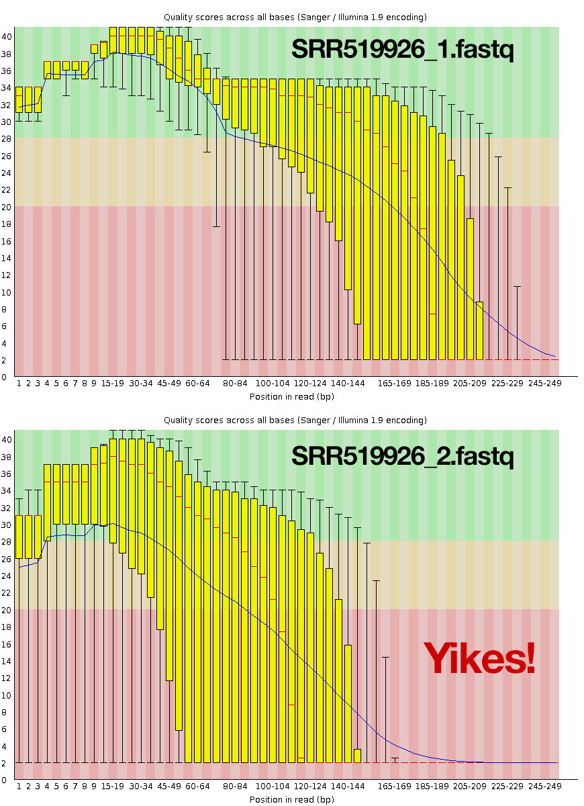
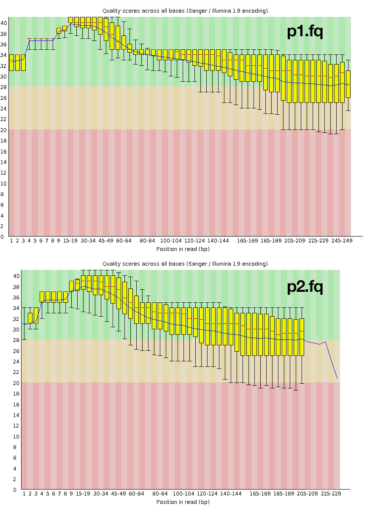

## Transferring FastQC Results
Note that the output is in a specific output directory, and is present at both an HTML file and a `*.zip` file.

The results are presented in an HTML file, but we can only open HTML files in browser, so we need to transfer this data back to our local machine and open it in chrome or firefox or something.

One way to do this is using the command line:

On your remote server, where is your data?

     $ pwd

open new terminal: On your labtop

     $ scp dcuser@ec2-54-174-230-106.compute-1.amazonaws.com:~/dc_workshop/results/fastqc_untrimmed_reads/*.html .

Alternatively, we could use a file transfer client (e.g., <https://cyberduck.io/>) to transfer the data graphically, as in the [instructions here](http://angus.readthedocs.org/en/2014/amazon/transfer-files-between-instance.html). Essentially, you'll want to open a new SFTP connection to the DNS address you were given using the key file to "get into" the instance and transfer the data.

Interpreting FastQC results

Let's have a look at the results. This is the boxplot analysis for your FASTQ data. Phred quality score is on the ordinate axis.  The purpose of this plot is to look at the overall quality of the sequence.

This indicates very poor quality toward the end of the reads. You can also look at lots of other quality issues, including potential adapter contamination, and over-represented kmers near the beginning of the read. Contrast this to a [good sequencing run](http://www.bioinformatics.babraham.ac.uk/projects/fastqc/good_sequence_short_fastqc.html).

## Trimming and filtering your sequence data
We're going to use a tool called Trimmomatic to trim and filter our sequence data.

- **Paper**: Bolger, Anthony M., Marc Lohse, and Bjoern Usadel. "Trimmomatic: a flexible trimmer for Illumina sequence data." _Bioinformatics_ (2014) 30(15):2114-20 doi:10.1093/bioinformatics/btu170. ([On PubMed Central](http://www.ncbi.nlm.nih.gov/pmc/articles/PMC4103590/)).
- **Software**: <http://www.usadellab.org/cms/?page=trimmomatic>
- **Manual**: <http://www.usadellab.org/cms/uploads/supplementary/Trimmomatic/TrimmomaticManual_V0.32.pdf> 

Trimmomatic is a fast, multithreaded command line tool that can be used to trim and crop Illumina (FASTQ) data as well as to remove adapters. 

The FastQC report above found evidence of adapter contamination, but adapter removal is a bit tricky so we're going to skip that here (but you should check out the manual above and try it on your own using the `TruSeq-3-PE-2.fa` adapter file in the Trimmomatic directory).

Now, let's run trimmomatic without any arguments and get some help (run it with java, giving it the full path to the trimmomatic jar file):

     $ java -jar ~/Trimmomatic-0.32/trimmomatic-0.32.jar

This gives us some help:

     Usage:
       PE [-threads <threads>] [-phred33|-phred64] [-trimlog <trimLogFile>] [-basein <inputBase> | <inputFile1> <inputFile2>] [-baseout <outputBase> | <outputFile1P> <outputFile1U> <outputFile2P> <outputFile2U>] <trimmer1>...
     or:
       SE [-threads <threads>] [-phred33|-phred64] [-trimlog <trimLogFile>] <inputFile> <outputFile> <trimmer1>...

Since we have single end data, we are going to use SE mode. then we give trimmomatic some trimmer keywords. We'll talk about those below:

     $ for infile in *.fastq
      >do
      >outfile=$infile\_trim.fastq
      >java -jar ~/Trimmomatic-0.32/trimmomatic-0.32.jar SE $infile $outfile SLIDINGWINDOW:4:20 MINLEN:20
      >done

1. `java -jar ~/data/Trimmomatic-0.32/trimmomatic-0.32.jar`: Run trimmomatic
1. `SE`: in paired end mode
1. `$infile': using these fastq input files
1. `SLIDINGWINDOW:4:20`: Perform a sliding window trimming, cutting once the average quality within the a 4-bp window falls below quality score of 20. By considering multiple bases, a single poor quality base will not cause the removal of high quality data later in the read. 
1. `MINLEN:20`: Trash reads completely if their surviving length is less than 50bp.

Now, let's create a new directory where we will store our trimmed reads.
     $ mkdir trimmed
     $ mv *_trim.fastq trimmed

## run FastQC
Now, let's fun FastQC again,
  
     cd ~/dc_workshop/data/untrimmed_fastq/trimmed 

     echo "Running fastqc..." 
     ~/FastQC/fastqc *.fastq   
     mkdir -p ~/dc_workshop/results/fastqc_trimmed_reads   

     echo "saving..."   
     mv *.zip ~/dc_workshop/results/fastqc_trimmed_reads/    
     mv *.html ~/dc_workshop/results/fastqc_trimmed_reads/   

     cd ~/dc_workshop/results/fastqc_trimmed_reads/

     echo "Unzipping..."   
     for zip in *.zip   
     do   
     unzip $zip   
     done   

     echo "saving..."
     cat */summary.txt > ~/dc_workshop/docs/fastqc_summaries_trimmed.txt

## download

    $ scp dcuser@ec2-54-174-230-106.compute-1.amazonaws.com:~/dc_workshop/results/fastqc_trimmed_reads/*.html .

